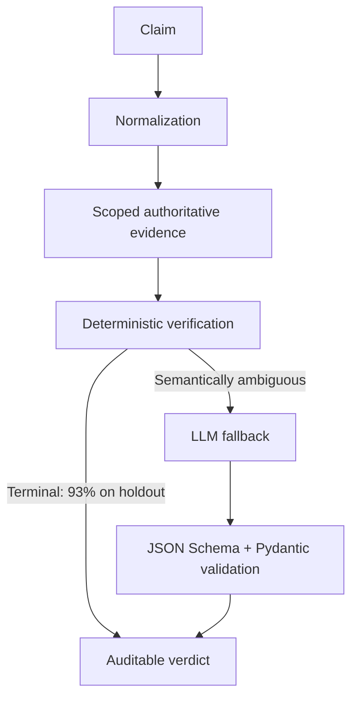

# Automated Claim Verification Pipeline

Commercial claims drift: prices change, offers expire, and copy outlives the source-of-truth
record it once described. This Python 3.12/FastAPI service checks a natural-language claim
against an authoritative catalog and returns an auditable verdict:

`SUPPORTED` · `CONTRADICTED` · `INSUFFICIENT_EVIDENCE` · `INVALID_CLAIM`

## Approach

Exact facts belong in deterministic code; an LLM is useful only when language remains
semantically ambiguous. The service retrieves claim-scoped evidence, runs typed rules first,
and calls a schema-constrained semantic rater only when those rules cannot settle the claim.
Missing facts produce `INSUFFICIENT_EVIDENCE`, never an invented contradiction.



This split makes exact comparisons reproducible, reduces model cost and latency, and limits
the facts the model can over-infer from. The LLM remains an optional, fallible adapter behind
provider-neutral domain interfaces.

## Quick start

Requirements: Python 3.12 and [uv](https://docs.astral.sh/uv/).

```bash
make setup
make test
make run
```

Setup installs the committed lock file; it does not regenerate catalog or evaluation data.
Offline mode is the default and requires no credential or model server. It supports all
deterministic claims and fails explicitly if a claim genuinely needs an LLM.

```bash
curl -s http://127.0.0.1:8000/health
curl -s http://127.0.0.1:8000/v1/claims/verify \
  -H 'content-type: application/json' \
  -d '{"claim":"Offer BACK159 costs $127.49.","reference_id":"offer-back-to-school-back159","as_of":"2026-09-10"}'
```

The response includes the verdict, confidence, stable reason codes, verification path,
claim-scoped evidence, escalation state, and per-stage latency:

```json
{
  "verdict": "SUPPORTED",
  "confidence": 1.0,
  "reason_codes": ["EXACT_MATCH"],
  "verification_path": "DETERMINISTIC",
  "evidence": {"reference_id": "offer-back-to-school-back159", "fields": {"price": "127.4900"}}
}
```

The example is abbreviated; `/docs` and `/openapi.json` contain the complete versioned schema.
Requests are limited to 1,000 claim characters, 256 KiB bodies, and 100 batch items by default.
Batch results preserve order and return expected failures per item. All errors use a stable
`{"error":{"code","message","details"},"request_id"}` envelope.

## Providers

- `fake` is credential-free/offline and used by tests and CI. It is not used for published
  measurements.
- `ollama` uses the native local API and strict structured output with the unchanged V1
  prompts. Run `make ollama-preflight` before an explicit real-model experiment.
- `openai` is optional and requires `ACV_LLM__API_KEY`; secrets are never committed.

Copy `.env.example` for the full typed configuration. See [Ollama deployment](docs/ollama.md)
for host/container networking and [deployment](docs/deployment.md) for wheel and Docker use.

## Evaluation and final results

The 400-case development corpus was used for diagnosis and Phase 7 optimization. The separate
500-case frozen synthetic holdout was then consumed exactly once per locked arm in Phase 8.
The 1,200-operation frozen performance workload is separate from both quality datasets.

| Frozen 500-case holdout | LLM-only baseline | Optimized hybrid |
| --- | ---: | ---: |
| Accuracy | 46.40% | 100.00% |
| Macro F1 | 31.18% | 100.00% |
| Injected-mismatch recall | 17/220 (7.73%) | 220/220 (100.00%) |
| False positives | 2/280 (0.714%) | 0/280 (0.00%) |
| Execution failures | 8 | 0 |
| Attempted LLM calls | 500 | 35 (93% fewer) |
| Recorded tokens | 368,191 | 21,722 (94.1% fewer) |

Performance is intentionally reported without disguising the slow semantic tail:

| Frozen 1,200-request workload | Result |
| --- | ---: |
| Overall mean / p50 / p95 | 1,012.75 / 1.512 / 11,569.27 ms |
| Deterministic mean / p95 | 2.328 / 6.861 ms |
| Deterministic / LLM-routed | 92.5% / 7.5% |
| Errors | 0 |

The low median comes from the deterministic majority. Remaining local-Qwen requests are
expensive, so an overall sub-200 ms claim is not supported.

Published runs bind predictions to config hashes, dataset and catalog fingerprints, prompt
hashes, the Ollama version, and the pinned model digest. `holdout_evaluated = true`: the
holdout is no longer available for tuning or a second independent comparison. CI verifies
identities but never regenerates datasets or runs official evaluation.

## Packaging and operation

The wheel packages the frozen final runtime profile, V1 prompts, and a synthetic demonstration
catalog. Each path can be replaced through typed environment settings for a governed deploy.

```bash
make build
make installed-wheel-smoke
make docker-build
make docker-run
```

`GET /health` is dependency-free liveness. `GET /ready` checks local catalog readiness and
reports an external model as `configured_not_checked`; it never performs an LLM call.
Prometheus metrics are at `/metrics`.

## Repository map

```text
app/api             HTTP schemas, routes, middleware, errors
app/domain          immutable models and provider-neutral protocols
app/normalization   deterministic parsing and optional extraction
app/retrieval       authoritative catalog and evidence projection
app/rules           deterministic rule engine
app/raters          fake, Ollama, and OpenAI adapters
app/verification    escalation, decision, and orchestration
app/evaluation      protected experiment tooling
configs/phase7      frozen optimized profile and historical candidates
artifacts/phase8    small published reports; raw predictions remain ignored
tests               network-free unit and integration coverage
```

## Limitations and security boundary

The bundled catalog and generated corpora are synthetic; their controlled language does not
represent all commerce or production traffic. Local Qwen behavior does not characterize every
hosted model, and 100% on one consumed holdout does not prove universal correctness. Confidence
is not calibrated for arbitrary domains.

The reference deployment is an internal service. Authentication, tenant isolation, distributed
rate limiting, and TLS termination are outside this repository; do not expose it directly to
the Internet. See [security](docs/security.md) for the threat boundary.

## Documentation

- [Architecture](docs/architecture.md)
- [Evaluation and benchmark finality](docs/evaluation.md)
- [Design decisions and configuration audit](docs/design-decisions.md)
- [Error analysis](docs/error-analysis.md)
- [Deployment](docs/deployment.md)
- [Security](docs/security.md)
- [Technical interview notes](docs/interview-notes.md)

## License

MIT — see [LICENSE](LICENSE).
