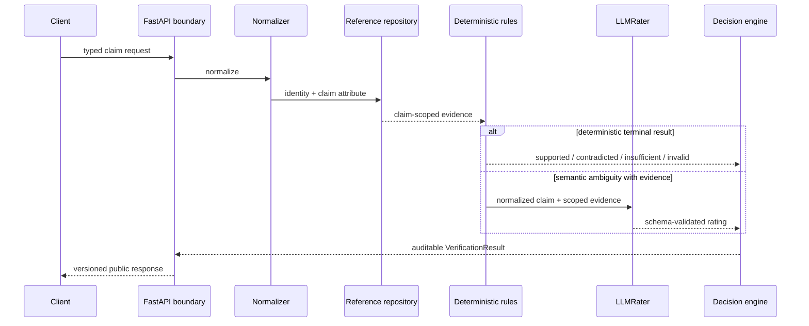

# Architecture

The system is a staged verifier, not an LLM wrapper. Immutable domain models and protocols
separate verification policy from HTTP and provider details.

## Boundaries

`ClaimExtractor` identifies what a claim asserts. `LLMRater` judges that assertion against
provided evidence. Both are domain protocols implemented by fake, OpenAI, and Ollama adapters;
provider request/response types never enter the domain. The composition root is the only place
that selects concrete adapters.

Prompts are immutable versioned resources. Claim, evidence, and context are separately encoded
JSON values. Adapters request JSON-Schema-constrained output and always validate again through
strict Pydantic models. Malformed, incomplete, conflicting, fenced, or schema-invalid output is
a typed execution failure, never a semantic verdict.

## Verification precedence

Normalization identifies entity, attribute, relation, qualifiers, negation, and time context.
Retrieval projects only authoritative fields relevant to that assertion. Terminal rule outcomes
take precedence. A known record with no relevant field produces `INSUFFICIENT_EVIDENCE`; model
interpretation cannot create evidence. Only an ambiguous, evidence-backed result may escalate.

The frozen final profile is `configs/phase7/optimized_final.yaml`. Its `id_only` retrieval,
explicit rule allow-list, invalid-claim gate, claim-scoped evidence, routing, and narrow
support-without-evidence guard are the final Phase 7 behavior. Deployment/provider values come
from typed environment settings and do not redefine quality policy.

## Runtime and failure model

`HybridVerificationService` owns deadlines, bounded batch concurrency, stage timing, escalation,
and audit assembly. Provider retries are bounded and distinguish timeout, rate limit, transport,
authentication, missing-model, malformed-output, and schema failures. Provider failure does not
affect a deterministic request; an ambiguous request fails explicitly rather than falling back
to fabricated evidence.

The HTTP layer enforces body, batch, and 1,000-character claim limits. Batch order is stable and
expected item errors are partial failures. Public evidence is scoped and typed; raw provider
bodies, rules' internal traces, credentials, and unrelated catalog terms are not returned.

`GET /health` is cheap process liveness. `GET /ready` checks the in-process repository and
reports real providers as `configured_not_checked`; neither endpoint calls an LLM. Prometheus
metrics use bounded labels for paths, verdicts, stages, stable errors, rules, and model identity.
Structured logs contain request IDs and claim hashes/lengths, never raw claim text.

## Packaged resources

The wheel embeds the frozen final profile, V1 rater/extractor prompts, and synthetic demonstration
catalog under `app/resources`. `importlib.resources` locates them outside a checkout. Every data
location can be overridden for deployments. Evaluation datasets and generated artifacts are
intentionally not runtime package data.
