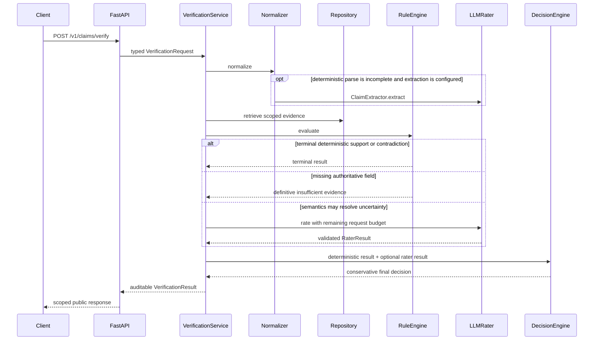

# Architecture

The authoritative reference dataset and deterministic rules remain the primary source of
truth. The LLM is a semantic escalation path for incomplete parsing and non-terminal rule
outcomes; it is not allowed to add facts.

```text
Deterministic parser -- sufficiently confident ------------------+
        |                                                        |
        +-- incomplete / low confidence --> LLM extractor -------+--> NormalizedClaim
                                                                      |
                                                                      v
                                                            Deterministic rules
                                                                      |
                                         terminal --------------------+---- ambiguous
                                            |                                |
                                            v                                v
                                         verdict                         LLM rater
                                                                                |
                                                                                v
                                                                     strict validation
                                                                                |
                                                                                v
                                                                         RaterResult
```

## Contracts and separation

`LLMRater` accepts a `NormalizedClaim`, claim-scoped `ReferenceEvidence`, and an explicit
`RatingContext`. `ClaimExtractor` accepts raw claim text and `ExtractionContext`, and returns
the existing `ClaimExtraction` representation. Both are domain protocols; neither imports a
provider SDK or provider response type. Extraction answers “what is asserted?” and never
answers “is it true?”.

The deterministic normalizer invokes an injected extractor only when
`llm_extraction_fallback` is enabled and the deterministic result is unparsed or below
`llm_extraction_below_confidence`. The returned `NormalizedClaim` records
`LLM_ASSISTED`, extraction confidence, and a source note.

## Prompt and output boundary

Prompts live under `prompts/<kind>/<version>.txt`. Rater V1 defines the reference-only truth
rule, missing-evidence abstention, explicit contradiction, semantic equivalence, numeric and
temporal caution, negation, and untrusted-claim handling. Claim text, evidence, and context
are serialized as separately labelled JSON values. This structural separation reduces, but
cannot eliminate, prompt-injection risk.

OpenAI's Responses API is requested with strict JSON Schema output and `store=false`.
Pydantic validates the response again with forbidden extra fields, closed enums, bounded
confidence, unique reason codes, and a short required explanation. Markdown fences, prose,
unknown codes, malformed JSON, and unsafe numeric coercion fail closed.

## Provider behavior and auditability

The OpenAI adapter uses asynchronous HTTP and owns a reusable connection pool unless one is
injected for tests. Credentials are read as `SecretStr` and never enter traces. A typed
`RaterMetadata` records provider, model, prompt/schema versions, and temperature. A typed
`RatingTrace` records trace/request IDs, attempts, provider and total latency, verdict,
confidence, reason codes, and optional token usage. Raw provider bodies are not logged.

HTTP 429, 5xx, transport resets, and timeouts are retryable with bounded exponential backoff
and jitter. Authentication failures, other permanent 4xx responses, malformed provider
bodies, and schema-invalid model output are not retried. Provider transport, authentication,
rate-limit, invalid-response, and schema-validation failures have distinct typed exceptions.

## Testing and limitations

Ordinary tests inject `httpx.MockTransport`, fake sleepers, `FakeRater`, and
`FakeClaimExtractor`; they never contact a provider or sleep. Prompt tests protect core policy
phrases without snapshotting the full prompt. `make smoke-llm` is opt-in and skips cleanly
unless OpenAI is explicitly configured.

Known limitations: prompt injection cannot be perfectly prevented; semantic grounding is
ultimately model behavior after structural and schema controls. Provider refusal/incomplete
response details are currently represented as an invalid response rather than finer failure
subtypes. The Phase 3 layer intentionally does not implement final hybrid decision policy,
confidence calibration, post-rater guards, or baseline-versus-optimized orchestration.

## Phase 4 service request path



`HybridVerificationService` is the application boundary. HTTP routes only validate and map
wire models. The service generates/propagates request IDs, invokes the existing stages,
applies the centralized escalation policy, enforces an overall deadline, records metrics and
structured completion logs, and assembles the internal audit result.

### Escalation and decision precedence

The escalation policy records one typed reason. Terminal deterministic support and
contradiction never escalate. An unresolved reference or a known record whose relevant field
is absent also does not escalate because language interpretation cannot create evidence.
Unparsed semantics, low parse confidence, uncovered claim types, and other non-terminal rule
results escalate only when a reference record with relevant evidence exists.

The decision engine gives terminal deterministic outcomes absolute precedence. Otherwise it
uses a validated rater result. When escalation is unnecessary, an existing deterministic
`INSUFFICIENT_EVIDENCE` result is retained. Confidence is deliberately not averaged: exact
deterministic confidence includes the parse-confidence gate, while LLM confidence remains
uncalibrated provider/model self-assessment. Calibration is deferred to a later phase.

Verification paths are explicit: `DETERMINISTIC`, `LLM_RATER`,
`DETERMINISTIC_WITH_LLM_EXTRACTION`, `LLM_EXTRACTION_AND_RATER`, and `FAILED_SAFE`. The last
value is reserved for typed audit/export uses; infrastructure failure is returned as an
execution error rather than disguised as a semantic verdict.

### API, failures, and bounded batches

The public API exposes `GET /health`, `POST /v1/claims/verify`, and
`POST /v1/claims/verify/batch`. Public evidence is derived from the claim-scoped projection
and removes unrelated terms text. It includes the reference update timestamp and a stable
fingerprint based on record identity and update time. Internal rule outcomes, provider raw
bodies, credentials, and authorization headers are not exposed.

An explicitly requested unknown reference is a `reference_not_found` execution error; a known
record with a missing field is a successful verification with `INSUFFICIENT_EVIDENCE`.
Provider failure propagates as a typed 429/5xx response with a generic public message. It is
never converted into a verdict. Deterministic requests continue to work during provider
failure. The overall per-item timeout cancels a hanging downstream call and produces a typed
504. In offline (`provider=fake`) production wiring, no rater is installed: deterministic
claims work, while claims that truly require semantics fail explicitly with `llm_unavailable`.

Batch size, request-body size, claim length, and concurrent item count are bounded by typed
settings. Items execute behind a semaphore, results preserve input order, and expected item
failures are returned beside successful items rather than aborting the batch. The LLM
transport retains its separate lower-level concurrency limit; the batch limit protects total
pipeline work, while the provider limit protects outbound model calls.

### Operational observability

Completion logs contain request/reference IDs, claim type, a short claim hash and length,
verdict, explicit path/escalation reason, parse confidence, LLM metadata and attempts, and
total latency. Raw claim text is not logged. Prometheus metrics cover requests/results,
verification paths and errors, per-stage latency, rules, semantic requests/failures/retries,
escalations, cache lookups, and batch size. Request/reference IDs and claim content are never
metric labels.

Stage timing separates deterministic normalization from LLM extraction, retrieval, rules,
rating, decision, and total wall time without double-counting. Provider and total rater
latencies remain available in the internal rating trace.
